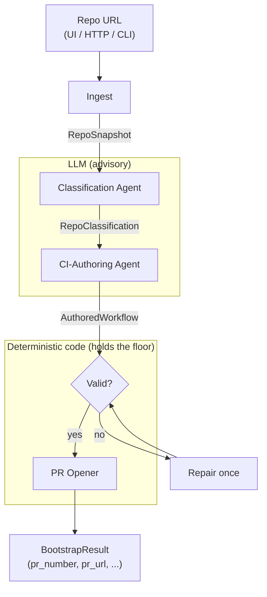

# CI Bootstrapping Agent — Design & Implementation

## What it does

Point the service at a **GitHub repository URL**. It:

1. **Clones** the repo and takes a compact snapshot of it.
2. **Classifies** the language/ecosystem (Classification Agent — an LLM).
3. **Authors** a complete GitHub Actions workflow tailored to that repo
   (CI-Authoring Agent — an LLM), then **validates** it deterministically.
4. **Opens a pull request** that adds the workflow, and returns the **PR number**.

The agent *writes CI configuration into a repository and opens a PR*. It does
**not** run the pipeline itself — the workflow it authors is what runs, inside
the target repo's own Actions, once merged (and it already runs on the PR).

Three ways to invoke it, all hitting the same core:

- **Web UI** — `GET /` serves a page with a URL box and a "Run agent" button.
- **HTTP API** — `POST /bootstrap {"repo_url": "...", "open_pr": true}`.
- **CLI** — `python -m bootstrap <repo_url> [--no-pr]`.

---

## Architecture

Two agents behind one service shell. The two-agent separation is deliberate
(and mandated by the spec): classification and authoring are distinct stages
that communicate only through a data contract — the authoring agent never
re-inspects the repo to decide the language.



**Why two agents, not one?** Classification is a cheap, narrow judgement
(small model, structured output); authoring is a richer generative task (larger
model). Splitting them keeps each prompt focused, lets us swap models
independently, makes the handoff inspectable (`RepoClassification` is logged and
returned), and means a bad classification can't silently corrupt authoring —
the contract is explicit.

**Where the LLM sits.** The LLM is *advisory*; deterministic code makes the
decisions that matter. Classification has a heuristic fallback; authored YAML
must pass a validation gate before any PR is opened. The LLM proposes; the code
disposes.

---

## The stages, and how each is implemented

All code lives in `agents/src/bootstrap/`.

### 1. Ingest — `ingest.py`

- Parses the GitHub URL into `(owner, name)` (`parse_repo_url`, regex; rejects
  non-GitHub URLs).
- **Shallow-clones** the repo (`git clone --depth 1`) into a temp dir. A token,
  if available, is embedded in the clone URL for private repos / rate limits and
  is never printed.
- Builds a **`RepoSnapshot`**: the file tree (`git ls-files`, capped at 400
  entries) plus the truncated contents of recognised **manifest files**
  (`requirements.txt`, `pyproject.toml`, `package.json`, `go.mod`, `pom.xml`,
  `*.csproj`, `Cargo.toml`, `Gemfile`, …). The snapshot is what both agents
  reason over — small and textual so it fits comfortably in an LLM context.

### 2. Classification Agent — `classify.py`

- Sends the snapshot to a **small model** (`claude-haiku-4-5`) with a system
  prompt asking for `{language, ecosystem, test_command, confidence, evidence}`
  as **structured output** (`messages.parse` + the `LLMClassification` Pydantic
  model — no fragile text parsing).
- **Confidence gate:** if the LLM's confidence is below `0.8`, or the API call
  fails, or no key is set, it falls back to a **deterministic heuristic**
  (`_classify_with_heuristic`) that maps manifest presence to a language. CI must
  degrade gracefully when the LLM is unavailable.
- Output is a **`RepoClassification`** — free-form `language`/`ecosystem`
  strings (not a closed enum) so the service generalises to any language.

### 3. CI-Authoring Agent — `author.py`

- Sends the snapshot **plus the classification** to a **larger model**
  (`claude-opus-4-8`) with a system prompt that specifies the requirements
  (triggers, `ubuntu-latest`, official setup actions, pinned versions,
  self-contained, based on the actual manifests). The YAML is **fully
  LLM-authored** — not templated.
- **Validation gate (`_validate`) — deterministic:**
  - parses as YAML (`yaml.safe_load`);
  - is a mapping with a trigger and a non-empty `jobs` block
    (handles the YAML footgun where a bare `on:` parses to the boolean `True`,
    not the string `"on"`);
  - if `actionlint` is installed, must lint clean (a bonus gate, skipped if
    absent).
- **One repair round-trip:** if validation fails, the errors are fed back to the
  LLM once for a fix, then re-validated. Nothing reaches a PR unless it passes.
- Output is an **`AuthoredWorkflow`** (`path`, `content`, `valid`,
  `validation_notes`, `repaired`, `rationale`, token usage).

### 4. PR Opener — `github.py`

- Creates a fresh branch, writes the workflow at
  `.github/workflows/<name>` (falls back to `ci-agent-<name>` if a file of that
  name already exists — never clobbers), commits it.
- **Push destination is chosen by access (`_can_push`):**
  - **Token can write to the target** → push the branch straight to the target
    and open the PR there.
  - **Token cannot write** → **fork** the repo into the authenticated account
    (`_ensure_fork`, polls until the fork is ready), push the branch to the
    fork, and open a **cross-fork PR** (`head = fork_owner:branch`). This is how
    a PR can be opened on a repo you don't own.
- Opens the PR via the REST API and returns `(pr_number, pr_url, branch)`. The
  token is only ever placed in the push remote URL, and is redacted from any
  error message.

### 5. Orchestration & interfaces

- **`core.py`** wires the stages together (`bootstrap(repo_url, open_pr)`) and
  turns any stage failure into a structured `BootstrapResult` (status
  `opened` / `authored_only` / `error`) rather than letting an exception cross
  the service boundary.
- **`service.py`** — FastAPI: `GET /` (web UI), `GET /health`,
  `POST /bootstrap`.
- **`__main__.py`** — the CLI (`python -m bootstrap <url>`, `--no-pr`,
  `--serve`).
- **`config.py`** — loads `ANTHROPIC_API_KEY` / `GH_TOKEN` from a gitignored
  `.env` at the repo root, so secrets are set once, not per run (a real env var
  always wins).

---

## Data contracts — `contracts.py`

| Contract | Role |
|---|---|
| `RepoSnapshot` | ingest → agents: file tree + manifest contents |
| `LLMClassification` | structured-output schema for the classifier |
| `RepoClassification` | **handoff:** Classification Agent → Authoring Agent |
| `LLMWorkflow` | structured-output schema for the author |
| `AuthoredWorkflow` | authored YAML + validation result |
| `BootstrapResult` | the final answer returned by HTTP/CLI |

---

## Key design decisions

- **Fully LLM-authored YAML + a validation gate.** Maximum flexibility (the
  model writes idiomatic, repo-specific CI) with a deterministic safety net so
  invalid YAML never ships. Chosen over templating (too rigid) and over
  unchecked LLM output (unsafe).
- **LLM advisory, code authoritative.** Heuristic fallback for classification;
  parse/lint gate for authoring. The system keeps working when the LLM is down
  and never opens a PR it can't stand behind.
- **Fork-then-PR.** Lets the agent target any repo, not just ones the token
  owns, without ever needing write access to a stranger's repo.
- **Set secrets once.** `.env` support so you don't re-enter the key per run.

## Current limitations

- Opens the PR against a repo's default branch only; no branch-protection or
  reviewer configuration.
- No caching of clones/classifications across runs.
- The single-worker dev server processes one bootstrap at a time.

---

## Running it

```bash
# one-time: create a gitignored .env with your key + a GitHub token
#   ANTHROPIC_API_KEY=...   GH_TOKEN=...

pip install -e ./agents[service]

# web UI + HTTP API
python -m bootstrap --serve --port 8080     # then open http://127.0.0.1:8080/

# or CLI
python -m bootstrap https://github.com/owner/repo          # classify, author, open PR
python -m bootstrap https://github.com/owner/repo --no-pr  # dry run (author + validate only)
```
